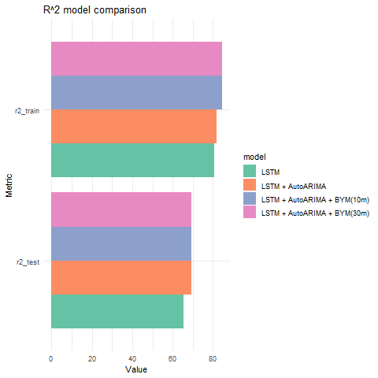

# Energy Consumption Modelling in IoT-surveyed Peacekeeping Missions

Author: Rodrigo Malagón Rodríguez

Date: January 2025

This repository contains the source code used in the thesis project
entitled
`Energy Consumption Modelling in IoT-surveyed Peacekeeping Missions` by
the author, presented at Universitat Jaume I, as a final thesis project
for the MSc. Geospatial Technologies.

The project focuses on processing and modelling energy consumption data,
captured by over 200 sensors located in a peacekeeping camp of the
United Nations Interim Security Force for Abyei (UNISFA) mission. Three
main methods —combining temporal and spatial dimensions— were used in
this work to build forecast models for power consumption: Long
Short-Term Memory (LSTM), Autoregressive Integrated Moving Average
(ARIMA), and Besag-York-Mollié (BYM). Theses model components rely on
methods from Deep Learning and Statistics. The main workflow is
distributed across Processing and Modelling modules. These are
accessible through the [`Data processing.md`](Data-processing.md) and
[`Modelling.md`](Modelling.md) files, respectively.

This project is the product of academy-ONG collaboration. The data used
in this work was shared by the [United Nations Global Service
Center](https://www.ungsc.org/) agency. Due to privacy concerns, we only
share the source code. However, to showcase the performance of our
models, we share in the [Results](#results) section some output
graphics. The methods and code by the author are shared through the
license in this repository.

The complete research report of this project is available in the
published [Project thesis](Project%20thesis.pdf).

## Results

<figure>

<figcaption aria-hidden="true">Comparison of fitted models in a
particular sensor’s time series (test set).</figcaption>
</figure>

<figure>

<figcaption aria-hidden="true">Comparison of Overall <em>R</em>2 across 4 model
combinations (all sensors considered).</figcaption>
</figure>
